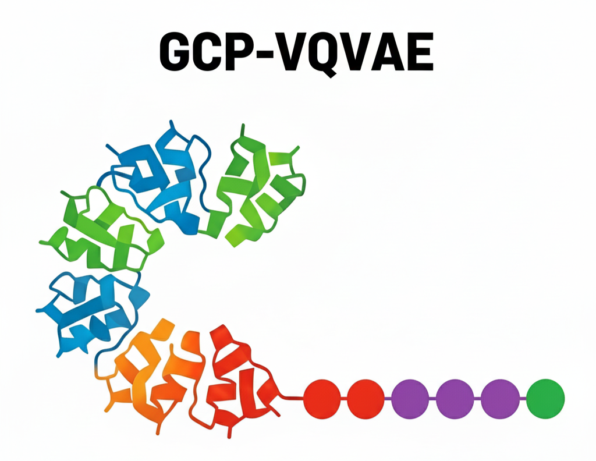
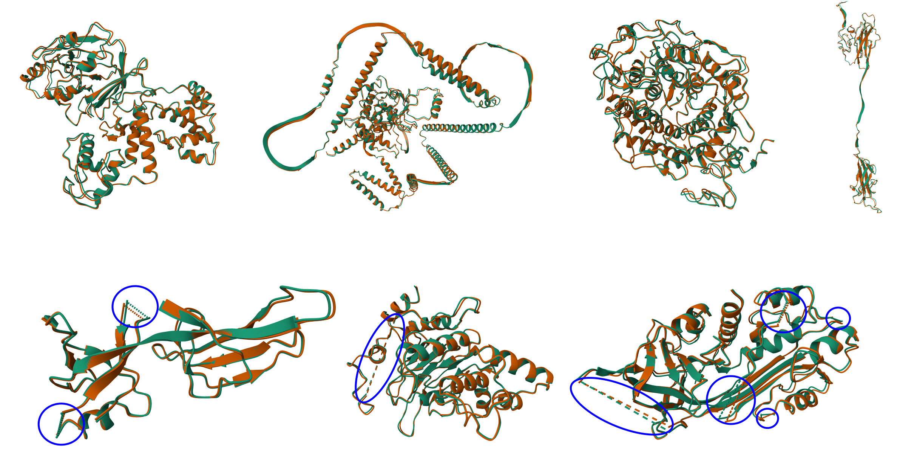
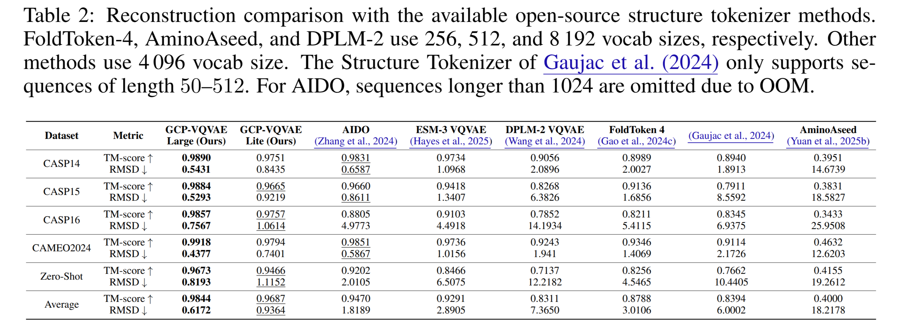

# GCP-VQVAE: A Geometry-Complete Language for Protein 3D Structure

[](https://opensource.org/licenses/MIT)
[](https://www.biorxiv.org/content/10.1101/2025.10.01.679833v2)

<p align="center">
  
</p>


## Abstract

Converting protein tertiary structure into discrete tokens via vector-quantized variational autoencoders (VQ-VAEs) creates a language of 3D geometry and provides a natural interface between sequence and structure models. While pose invariance is commonly enforced, retaining chirality and directional cues without sacrificing reconstruction accuracy remains challenging. In this paper, we introduce GCP-VQVAE, a geometry-complete tokenizer built around a strictly SE(3)-equivariant GCPNet encoder that preserves orientation and chirality of protein backbones. We vector-quantize rotation/translation-invariant readouts that retain chirality into a 4096-token vocabulary, and a transformer decoder maps tokens back to backbone coordinates via a 6D rotation head trained with SE(3)-invariant objectives.

Building on these properties, we train GCP-VQVAE on a corpus of 24 million monomer protein backbone structures gathered from the AlphaFold Protein Structure Database. On the CAMEO2024, CASP15, and CASP16 evaluation datasets, the model achieves backbone RMSDs of 0.4377 Å, 0.5293 Å, and 0.7567 Å, respectively, and achieves 100% codebook utilization on a held-out validation set, substantially outperforming prior VQ-VAE–based tokenizers and achieving state-of-the-art performance. Beyond these benchmarks, on a zero-shot set of 1938 completely new experimental structures, GCP-VQVAE attains a backbone RMSD of 0.8193 Å and a TM-score of 0.9673, demonstrating robust generalization to unseen proteins. Lastly, we elaborate on the various applications of this foundation-like model, such as protein structure compression and the integration of generative protein language models. We make the GCP-VQVAE source code, zero-shot dataset, and its pretrained weights fully open for the research community.



## News
- 🗓️ **25 Sept 2025** — 🎉 Our paper was accepted to the NeurIPS 2025 AI4Science workshop!
- 🗓️ **3 Oct 2025** — Our preprint has been published in [bioRxiv](https://www.biorxiv.org/content/10.1101/2025.10.01.679833v2).
- 🗓️ **10 Oct 2025** — 🚀 Pretrained checkpoints and evaluation datasets are now available for download!
- 🗓️ **17 Oct 2025** - Release a lite version of GCP-VQVAE with half the parameters.
- 🗓️ **22 Dec 2025** - Add Protein Structure Tokenizer benchmark evaluation scripts and instructions. Refer to [pst_evaluation/README.md](./pst_evaluation/README.md).
- 🗓️ **31 Dec 2025** - Added a simplified evaluation demo and refactored README docs for easier navigation. See [demo/README.md](demo/README.md).
- 🗓️ **23 Jan 2026** - Released the standalone `gcp-vqvae` Python package for inference (encode/embed/decode) with a lightweight install path.


## Requirements

- Python 3.10+
- PyTorch 2.5+
- CUDA-compatible GPU
- 16GB+ GPU memory recommended for training
- 12GB+ GPU memory recommended for inference/evaluation


## Installation
See [docs/installation/README.md](docs/installation/README.md) for Docker images, Dockerfile build steps, and 
optional FlashAttention-3 notes.

### Standalone Python package (gcp-vqvae)
If you only want the inference wrapper, see `gcp-vqvae/README.md` for full details.

One-line install from GitHub (uses `gcp-vqvae/pyproject.toml`):
```bash
pip install "git+https://github.com/mahdip72/vq_encoder_decoder.git@master#subdirectory=gcp-vqvae"
```


Minimal usage:
```python
from gcp_vqvae import GCPVQVAE

# Encode (HF model).
encoder = GCPVQVAE(
    mode="encode",
    hf_model_id="Mahdip72/gcp-vqvae-lite",
    mixed_precision="bf16",
)
records = encoder.encode(
    pdb_dir="/abs/path/to/pdb_dir",
    batch_size=8,
    show_progress=False,
)

# Embed (HF model).
embedder = GCPVQVAE(
    mode="embed",
    hf_model_id="Mahdip72/gcp-vqvae-lite",
    mixed_precision="bf16",
)
embeddings = embedder.embed(
    pdb_dir="/abs/path/to/pdb_dir",
    batch_size=4,
    show_progress=False,
)

# Decode (HF model).
decoder = GCPVQVAE(
    mode="decode",
    hf_model_id="Mahdip72/gcp-vqvae-lite",
    mixed_precision="bf16",
)
coords = decoder.decode(["1 2 3 4 5", "6 7 8"], batch_size=2)
```

Notes:
- Use `mode="embed"` with `embed()` for embeddings, and `mode="decode"` with `decode()` for coordinates.
- Use `mode="all"` to load encode/embed + decode paths in one object.
- `mode="decode"` only builds/loads the VQ + decoder path (encoder is not constructed).
- Encode/embed take `pdb_dir` inputs; preprocessing happens inside the package.
- Progress bars are available via `show_progress=True` (default: false).
- External logging is suppressed by default; set `suppress_logging=False` if you need verbose logs.
- `mixed_precision` defaults to `bf16` on CUDA; use `mixed_precision="no"` to disable.
- Set `deterministic=True` and `shuffle=False` for repeatable outputs.
- Pass `hf_model_id="Mahdip72/gcp-vqvae-lite"` (or another repo) to use Hugging Face downloads.

## Data Pipeline

For training and inference scripts (separate from `demo/`), convert structure PDB/CIF files to HDF5 and use
those `.h5` datasets as inputs. The standalone `gcp-vqvae` package operates directly on PDB/CIF inputs via
`pdb_dir`. Full data prep, formats, and conversion details live in 
[docs/data/README.md](docs/data/README.md).

### Evaluation Datasets

| Dataset | Description | Download Link |
|---------|-------------|---------------|
| CAMEO2024 | CAMEO 2024 evaluation dataset | [Download](https://mailmissouri-my.sharepoint.com/:f:/g/personal/mpngf_umsystem_edu/ErhhREP9bH5AoBBOe5IshCUBix3KAvYvZpAS7f1FS3pB_g?e=gQPDWl) |
| CASP14 | CASP 14 evaluation dataset | [Download](https://mailmissouri-my.sharepoint.com/:f:/g/personal/mpngf_umsystem_edu/EgMgJtM0fdNHpU46opUf0OgBZxhlJiV8Xu8N1Ke2lgw0mg?e=0d46eL) |
| CASP15 | CASP 15 evaluation dataset | [Download](https://mailmissouri-my.sharepoint.com/:f:/g/personal/mpngf_umsystem_edu/EgMgJtM0fdNHpU46opUf0OgBZxhlJiV8Xu8N1Ke2lgw0mg?e=0d46eL) |
| CASP16 | CASP 16 evaluation dataset | [Download](https://mailmissouri-my.sharepoint.com/:f:/g/personal/mpngf_umsystem_edu/EgMgJtM0fdNHpU46opUf0OgBZxhlJiV8Xu8N1Ke2lgw0mg?e=0d46eL) |
| Zero-Shot | Zero-shot evaluation dataset | [Download](https://mailmissouri-my.sharepoint.com/:f:/g/personal/mpngf_umsystem_edu/EiPEh9RGgypEi_LRWlNhLi0BSlbFsr9VryhKT1v8MYLj7Q?e=Uhr3bF) |

## Usage

Full multi-GPU training/inference/evaluation workflows are documented in [docs/usage/README.md](docs/usage/README.md). 
The demo workflow below is for quick local evaluation of checkpoints on raw PDB/CIF inputs.

### Pretrained Models

| Model | Description | Download Link | HF Hub |
|-------|-------------|---------------|--------|
| Large | Full GCP-VQVAE model with best performance | [Download](https://mailmissouri-my.sharepoint.com/:u:/g/personal/mpngf_umsystem_edu/EaxLj74pK5BArOpPkF9MkDgBHxlfaDpAElPRiwH9BsIedA?e=34ida8) | `Mahdip72/gcp-vqvae-large` |
| Lite | Lightweight version for faster inference | [Download](https://mailmissouri-my.sharepoint.com/:u:/g/personal/mpngf_umsystem_edu/EUXZF_Is2X9IrjLeIWk7T5gBNb3yliRwVOAWi2rHyyympg?e=VAveKw) | `Mahdip72/gcp-vqvae-lite` |

**Setup Instructions:**
1. Download the zip file of the checkpoint
2. Extract the checkpoint folder
3. Set the `trained_model_dir` path in your config file (following ones) to point to the right checkpoint.

### Simplified Evaluation Demo
The demo pipeline (`demo/demo_evaluation.py`) preprocesses raw PDB/CIF/mmCIF files, encodes tokens, optionally writes
embeddings, and can reconstruct + evaluate PDBs. It is meant for quick testing of checkpoints without the full multi-GPU stack.
See [demo/README.md](demo/README.md) for setup and usage.

Example demo config (`demo/demo_eval_config.yaml`):
```yaml
trained_model_dir: "/abs/path/to/trained_model"  # Directory of model checkpoint result in timestamped 
checkpoint_path: "checkpoints/best_valid.pth"  # Relative to trained_model_dir
config_vqvae: "config_vqvae.yaml"  # Saved training config name
config_encoder: "config_gcpnet_encoder.yaml"  # Saved encoder config name
config_decoder: "config_geometric_decoder.yaml"  # Saved decoder config name

data_dir: "/abs/path/to/pdb_cif_dir"  # Root of PDB/CIF/mmCIF files (recursive)
output_base_dir: "demo_results"  # Output parent dir (timestamped subdir created)

batch_size: 2  # Inference batch size
num_workers: 0  # DataLoader workers
max_task_samples: 0  # 0 means no limit
tqdm_progress_bar: true  # Show progress bars

alignment_strategy: "kabsch"  # kabsch or no (type of alignment before evaluation)
mixed_precision: "bf16"  # no, fp16, bf16

save_indices_csv: true  # Write discrete tokens into vq_indices.csv
save_embeddings_h5: false  # Write continuous VQ embeddings into vq_embed.h5
save_pdb_and_evaluate: true  # Write original and reconstrued coordinates in PDB format and evaluate TM-score/RMSD
```

Minimum config requirement: set `trained_model_dir` and `data_dir`.

### Training
For full training (Accelerate, multi-GPU), see [docs/usage/README.md#training](docs/usage/README.md#training).

### Inference
For full inference scripts (encode/embed/decode) and multi-GPU setup, see [docs/usage/README.md#inference](docs/usage/README.md#inference).

### Evaluation
For full evaluation scripts and config details, see [docs/usage/README.md#evaluation](docs/usage/README.md#evaluation).

## External Tokenizer Evaluations

We evaluated additional VQ-VAE backbones alongside GCP-VQVAE:

- ESM3 VQVAE (forked repo: [mahdip72/esm](https://github.com/mahdip72/esm)) – community can reuse `pdb_to_tokens.py` and `tokens_to_pdb.py` that we authored because the upstream project lacks ready-to-use scripts.
- FoldToken-4 (forked repo: [mahdip72/FoldToken_open](https://github.com/mahdip72/FoldToken_open)) – we rewrote `foldtoken/pdb_to_token.py` and `foldtoken/token_to_pdb.py` for better performance and efficiency with negligible increase in error.
- Structure Tokenizer ([instadeepai/protein-structure-tokenizer](https://github.com/instadeepai/protein-structure-tokenizer)) – results reproduced with the official implementation.

Let us know if you need the scripts of more baseline tokenizers evaluated in the recent update of the manuscript.

## Results

The table below reproduces Table 2 from the manuscript: reconstruction accuracy on community benchmarks and a zero-shot setting. Metrics are backbone TM-score (↑) and RMSD in Å (↓).

<p align="center">
  
</p>

## Experimental Features

- Added an experimental option to compress token sequences using latent codebooks inspired by [ByteDance’s 1D tokenizer](https://github.com/bytedance/1d-tokenizer) (TiTok); this enables configurable compression factors within our VQ pipeline.
- Added the residual quantization (multi-depth VQ) using a shared codebook when `ti_tok.residual_depth > 1`. This only works when ti_tok is enabled which means the residual latents are packed depth-by-depth, flattened into a single stream for NTP and decoding, and their masks/embeddings remain aligned with the flattened indices. This improves reconstruction capacity without expanding the base codebook.
- Included an optional next-token prediction head, drawing on the autoregressive regularization ideas from *“When Worse is Better: Navigating the Compression-Generation Tradeoff in Visual Tokenization”*, to encourage codebooks that are friendlier to autoregressive modeling.
- Enabled adaptive loss coefficients driven by gradient norms: each active loss (MSE, distance/direction, VQ, NTP) tracks its synchronized gradient magnitude and scales its weight toward the 0.2–5.0 norm “comfort zone.” Coefficients shrink when a loss overpowers the rest and grow when its gradients fade, keeping the multi-objective training balanced without constant manual re-tuning.

## Acknowledgments

This repository builds upon several excellent open-source projects:

- [**vector-quantize-pytorch**](https://github.com/lucidrains/vector-quantize-pytorch) – Vector quantization implementations used in our VQ-VAE architecture.
- [**x-transformers**](https://github.com/lucidrains/x-transformers) – Transformer components integrated into our encoder and decoder modules of VQ-VAE.
- [**ProteinWorkshop**](https://github.com/a-r-j/ProteinWorkshop) – We slimmed the original workshop down to the GCPNet core and extended it with:
  - opt-in `torch.compile` support that now powers our training, inference, and evaluation paths (configurable in every config file).
  - faster aggregation backends: a CSR/`torch.segment_reduce` implementation for PyTorch-only setups and an automatic switch to cuGraph-ops fused aggregators when `pylibcugraphops` is installed.
  - multi-GPU friendly evaluation utilities that reuse the same compilation flags as training, keeping the code path consistent across scripts.

We gratefully acknowledge **NVIDIA** for providing computational resources via their dedicated server that made 
this project feasible, enabling us to train and evaluate our models at scale.


## 📜 Citation

If you use this code or the pretrained models, please cite the following paper:

```bibtex
@article{Pourmirzaei2025gcpvqvae,
  author  = {Pourmirzaei, Mahdi and Morehead, Alex and Esmaili, Farzaneh and Ren, Jarett and Pourmirzaei, Mohammadreza and Xu, Dong},
  title   = {GCP-VQVAE: A Geometry-Complete Language for Protein 3D Structure},
  journal = {bioRxiv},
  year    = {2025},
  doi     = {10.1101/2025.10.01.679833},
  url     = {https://www.biorxiv.org/content/10.1101/2025.10.01.679833v2}
}
```
